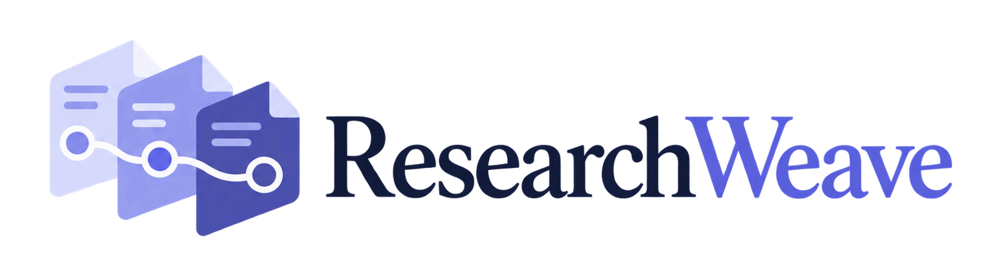
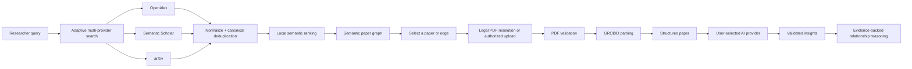

<p align="center">
  
</p>

<p align="center"><strong>Explore, understand, and connect scholarly research.</strong></p>

<p align="center">
  <a href="https://github.com/SanjanaSrabanti16/ResearchWeave/actions/workflows/ci.yml"></a>
  <a href="LICENSE"></a>
  
  
</p>

ResearchWeave is an open-source, query-centered system for scholarly discovery and analysis. It searches multiple scholarly sources, normalizes and deduplicates papers, ranks them with local models, and presents the result as an interactive semantic graph. From the same workspace, researchers can resolve accessible PDFs, parse papers with GROBID, generate evidence-grounded explanations with a selected AI provider, and review pairwise paper relationships.

ResearchWeave is currently a `v0.1.0-alpha` research prototype. Its interfaces and generated analyses should not be treated as production guarantees or as substitutes for reading the source literature.

## Why ResearchWeave?

Traditional scholarly search often leaves researchers with long result lists, duplicate records, fragmented PDF access, and little help understanding why papers matter individually or together. ResearchWeave combines discovery, visual exploration, document understanding, and relationship reasoning in one workflow while keeping source evidence visible and failures contained to the provider or operation that caused them.

## Key features

### Multi-source scholarly search

- Searches **OpenAlex**, **Semantic Scholar**, and **arXiv** independently.
- Expands queries without requiring a paid query-generation service.
- Normalizes, deduplicates, and merges provider records into a consistent paper list.
- Preserves useful partial results when an individual source is unavailable.

### Semantic ranking and graph exploration

- Ranks papers locally for relevance, including reliable handling of exact-title searches.
- Builds a semantic paper graph from the ranked result set.
- Shows query-related concept chips and coordinated graph, paper-list, hover, selection, and Back interactions.

### Robust PDF acquisition and parsing

- Tries known direct PDF URLs and arXiv locations, then metadata-driven routes through Europe PMC/PMC, Unpaywall, Crossref, DOI landing pages, and publisher landing-page metadata.
- Verifies redirects and hosts, streams through a size limit, checks content type, and validates the PDF signature before parsing.
- Falls through safely when one candidate is invalid or unavailable; authorized user upload remains the final route.
- Parses validated PDFs locally with **GROBID** into structured metadata, sections, references, and evidence-ready text.

### Grounded paper understanding

- Supports **Local Ollama**, **Google Gemini**, and an **OpenAI-compatible EVL Gemma** provider behind one interface.
- Adapts paper processing to the selected model's context capacity.
- Produces a consistent ten-section explanation with supporting paper evidence.
- Keeps provider selection explicit and reuses successful analysis where appropriate.

### Evidence-backed relationship reasoning

- Compares evidence from two analyzed papers when a user selects a graph edge.
- Shows supporting evidence from both papers for generated relationships.
- Supports **Accept**, **Reject**, and **Edit** review decisions with review history.
- Requires papers to be analyzed before relationship generation begins.

### Reliability by design

- Uses bounded retries and request limits around external services.
- Keeps successful provider results when another provider fails.
- Treats useful partial results as a successful search state and exposes provider health in the UI.
- Keeps failures isolated to the affected feature where possible.

## How it works



Search, PDF acquisition, parsing, paper understanding, and relationship generation remain separate user-facing stages, so optional integrations can be configured independently.

## Quick start

### Prerequisites

- [Git](https://git-scm.com/)
- Docker Desktop with Docker Compose, or Docker Engine with the Compose plugin
- Sufficient disk space for Python/ML dependencies and the ranking-model cache

Clone and start the discovery application:

```bash
git clone https://github.com/SanjanaSrabanti16/ResearchWeave.git
cd ResearchWeave
docker compose up --build
```

Open:

- Frontend: <http://localhost:5173>
- Backend health/API: <http://localhost:8000/health>
- Interactive API documentation: <http://localhost:8000/docs>

Basic scholarly search requires no private credential, although public APIs may rate-limit unauthenticated traffic. The first ranked search downloads the configured Hugging Face ranking models into a persistent Docker volume and therefore takes longer.

To include local PDF parsing, start the opt-in GROBID profile:

```bash
docker compose --profile pdf up --build
```

GROBID is not required for search or graph exploration. Ollama is also optional and runs separately from this Compose stack.

## Configuration

Defaults are safe for basic local search. To configure optional integrations, copy the template before starting the stack:

```bash
cp .env.example .env
```

PowerShell:

```powershell
Copy-Item .env.example .env
```

Never commit `.env`. Do not place credentials in `VITE_*` variables because Vite embeds them in public browser assets.

### Common environment variables

| Variable | Required | Purpose |
| --- | --- | --- |
| `RANKING_PROFILE` | No | Local ranking profile; defaults to `fast`. |
| `SEMANTIC_SCHOLAR_API_KEY` | No | Authenticated Semantic Scholar access; public access is used where permitted. |
| `OPENALEX_API_KEY` | No | Optional OpenAlex credential. |
| `UNPAYWALL_EMAIL` | For Unpaywall | Enables DOI lookup through Unpaywall and supplies contact metadata to compatible services. |
| `LLM_PROVIDER` | No | Default analysis provider: `ollama`, `gemini`, or `evl_gemma`. |
| `OLLAMA_MODEL` | For Ollama analysis | Local Ollama model; the template defaults to `qwen3:1.7b`. |
| `OLLAMA_BASE_URL` | For local-development Ollama | Local Ollama HTTP endpoint. Only local addresses are accepted. |
| `OLLAMA_DOCKER_BASE_URL` | For Docker-to-host Ollama | Backend-container route to the separately running host Ollama service. |
| `GEMINI_API_KEY` | For Gemini | Backend-only Google Gemini credential. |
| `GEMINI_MODEL` | For Gemini | Gemini model selection. |
| `EVL_GEMMA_API_KEY` | For EVL Gemma | Backend-only credential for the configured OpenAI-compatible provider. |
| `EVL_GEMMA_BASE_URL` | For EVL Gemma | HTTPS base URL for that OpenAI-compatible service. |
| `EVL_GEMMA_MODEL` | For EVL Gemma | Remote model identifier. |
| `PDF_MAX_SIZE_MB` | No | Maximum accepted downloaded or uploaded PDF size. |
| `GROBID_URL` | For PDF parsing | GROBID endpoint; Compose wires this automatically under the `pdf` profile. |
| `CORS_ORIGINS` | No | Browser origins allowed by the backend. |
| `VITE_API_URL` | No | Public backend URL compiled into the frontend. Never put a secret here. |

See [`.env.example`](.env.example) for current defaults and optional advanced overrides.

## AI provider setup

The **Analysis provider** selector is explicit. ResearchWeave does not silently switch from one cloud provider to another.

### Local Ollama

1. Install [Ollama](https://ollama.com/) for your platform.
2. Pull the configured model:

   ```bash
   ollama pull qwen3:1.7b
   ```

3. Start Ollama and set `LLM_PROVIDER=ollama` if it should be the default.

Ollama inference remains local. A GPU is not required by ResearchWeave, but model speed and quality depend on the selected model and available CPU, memory, and optional acceleration. In Docker, the backend reaches the host service through `OLLAMA_DOCKER_BASE_URL`.

### Google Gemini

Set `GEMINI_API_KEY` and optionally `GEMINI_MODEL`, then choose **Google Gemini** in the UI. The selected paper context is sent to Google for analysis; review the provider's terms and your data-handling requirements first.

### EVL Gemma / OpenAI-compatible service

Set `EVL_GEMMA_API_KEY`, `EVL_GEMMA_BASE_URL`, and `EVL_GEMMA_MODEL`, then choose **EVL Gemma**. This is an OpenAI-compatible remote provider interface; ResearchWeave does not bundle access credentials or require this service for local use.

### Running without optional providers

- Without a Gemini key, Gemini appears as unconfigured and the application still runs.
- Without EVL/OpenAI-compatible configuration, EVL Gemma remains unavailable.
- Without Ollama, local analysis is unavailable, but search, graph exploration, PDF parsing, and configured cloud analysis remain usable.
- If a scholarly API fails, successful providers can still return a partial result set.
- If no accessible PDF route succeeds, the UI offers upload of a PDF you are authorized to use.

Provider switching is always a user action. A failed analysis can be retried with the same provider or, when configured, the user can deliberately select another one.

## Using ResearchWeave

1. Enter a **Research topic**, optional **Start year** and **End year**, and the desired number of **Papers**.
2. Select **Search**. Review related concepts and the compact source-health summary.
3. Explore the semantic graph or ranked paper list. Hovering and selecting remain coordinated across both views.
4. Open a paper to inspect its metadata and abstract.
5. Select **Get PDF** to try public acquisition routes. If necessary, choose **Upload a PDF you are authorized to use**.
6. After GROBID parsing, choose an **Analysis provider** and select **Extract grounded insights**.
7. Expand evidence beneath an insight to inspect the supporting chunk and quote.
8. Select a graph edge to open **Relationship Analysis**. Both papers must already have current parsed documents and grounded insights.
9. Generate a proposal explicitly, then **Accept**, **Reject**, or **Edit** it. Review history remains available in the relationship panel.

## Research insight sections

Every provider returns the same normalized structure:

1. Paper Overview
2. Research Problem
3. Methods
4. Key Contributions
5. Evaluation
6. Main Findings
7. Why It Matters
8. Target Audience
9. Limitations / Open Challenges
10. Future Work

ResearchWeave adapts processing to the selected provider while keeping the final section structure consistent. Grounded claims include supporting evidence from the paper; users should still verify generated explanations against the source.

## Graph semantics

The graph uses three independent encodings:

| Visual encoding | Meaning |
| --- | --- |
| Node size | Similarity/relevance to the original user query |
| Node opacity | Information completeness for that canonical paper |
| Edge width | Query-independent paper-to-paper semantic similarity |

Information completeness increases as ResearchWeave has more usable material for a paper—for example, an abstract, a parsed PDF, or generated insights. Low-completeness papers remain visible.

## PDF access and copyright

ResearchWeave attempts to retrieve publicly accessible PDF locations through independent legal routes: known provider links, arXiv, Europe PMC/PMC, Unpaywall, Crossref, DOI resolution, and PDF metadata exposed by publisher landing pages. Every candidate still passes network-safety and PDF validation checks.

ResearchWeave does **not** bypass paywalls, defeat authentication, or circumvent publisher access controls. When no public PDF can be retrieved, users may upload a PDF they are authorized to use. Users remain responsible for complying with copyright, license, institutional-access, and provider terms.

## Reliability and graceful degradation

ResearchWeave expects external services to be imperfect:

- A provider outage does not discard successful papers from other providers.
- Query expansion avoids unnecessary follow-up requests when a source is already degraded.
- Retries and deadlines are bounded so one source cannot hold the entire request indefinitely.
- Search and PDF acquisition fail independently where possible.
- Provider health is shown as active, degraded, or unavailable without turning useful partial results into a total failure.
- PDF routes fail independently, and authorized upload remains available.
- AI-provider errors remain local to the selected provider and do not trigger silent cloud-provider substitution.

## Privacy and data boundaries

- **Ollama:** paper inference stays on the local Ollama service.
- **Gemini:** selected paper context is sent to Google only when Gemini is selected.
- **EVL Gemma/OpenAI-compatible:** selected paper context is sent to the configured remote endpoint only when that provider is selected.
- Provider credentials stay in the backend environment and are never returned to the browser.
- ResearchWeave does not silently fail over between cloud analysis providers.
- Local caches may contain bibliographic metadata, parsed text, evidence quotes, generated insights, or relationship records. Protect or remove them according to your data-handling requirements.
- Upload only documents you are authorized to process, and review external-provider privacy terms before sending paper content.

These boundaries describe the implemented data flow; they are not legal or compliance guarantees.

## Local development

### Prerequisites

- Python `>=3.11`
- Node.js `>=20.19.0 <21` or `>=22.13.0`
- npm `>=10`
- Docker Compose when running GROBID or containerized services
- Ollama only when local AI analysis is desired

### Backend

```bash
cd backend
python -m venv .venv
# PowerShell: .venv\Scripts\Activate.ps1
# macOS/Linux: source .venv/bin/activate
python -m pip install -e ".[dev]"
python -m uvicorn app.main:app --reload --port 8000
```

Start GROBID from the repository root when developing PDF parsing:

```bash
docker compose --profile pdf up -d grobid
```

### Frontend

```bash
cd frontend
npm ci
npm run dev
```

The normal Vite development server is local-only. `npm run dev:host` deliberately binds to the network and should be used only when that exposure is intended.

### Docker

```bash
docker compose config --quiet
docker compose build backend frontend
docker compose up
```

## Testing and quality checks

Backend tests use deterministic fakes/mocks instead of requiring live scholarly APIs or AI providers:

```bash
cd backend
pytest
ruff check .
ruff format --check .
```

Frontend tests and build checks:

```bash
cd frontend
npm test
npm run lint
npm run typecheck
npm run build
```

Container checks:

```bash
docker compose config --quiet
docker compose build backend frontend
```

GitHub Actions runs repository whitespace checks, the Python 3.11 backend suite, the Node 20.19 frontend suite, and bounded backend/frontend image builds. CI does not call live scholarly providers, invoke an AI model, download an Ollama model, or start GROBID.

## Project structure

```text
ResearchWeave/
|-- .github/                 # Continuous integration
|-- backend/                 # FastAPI application and tests
|-- frontend/                # React/D3 application and tests
|-- .env.example             # Safe configuration template
|-- CONTRIBUTING.md
|-- SECURITY.md
|-- LICENSE
|-- docker-compose.yml
`-- README.md
```

Generated caches, parsed-paper artifacts, PDFs, model files, logs, and local `.env` files must not be committed.

## Current limitations

- Scholarly APIs can be incomplete, rate-limited, or temporarily unavailable; partial results may differ across runs as upstream indexes change.
- Some publisher sites block automated server-side retrieval, and subscription PDFs may require authorized user upload.
- GROBID parsing quality depends on PDF structure; reliable page mapping is not always available.
- Ranking models download on first use and can be slower on CPU-only systems.
- AI quality, latency, context capacity, quotas, and availability vary by provider and model.
- Relationship reasoning requires both papers to have current parsed documents and validated insights.
- ResearchWeave is not a systematic-review, legal, medical, or clinical decision-making substitute.

## Roadmap

Future directions are intentionally broad: richer literature synthesis, broader scholarly integrations, and continued evaluation and usability improvements. These are not delivery commitments.

## Contributing

Issues and focused pull requests are welcome. Please read [CONTRIBUTING.md](CONTRIBUTING.md), add deterministic tests for behavior changes, run the documented quality checks, and avoid committing credentials or private paper content.

## Security

Report vulnerabilities privately as described in [SECURITY.md](SECURITY.md), not in a public issue. Never commit credentials, `.env`, private provider endpoints, PDFs, parsed-paper output, local databases, caches, logs, or model artifacts.

## License

ResearchWeave is available under the [MIT License](LICENSE).
