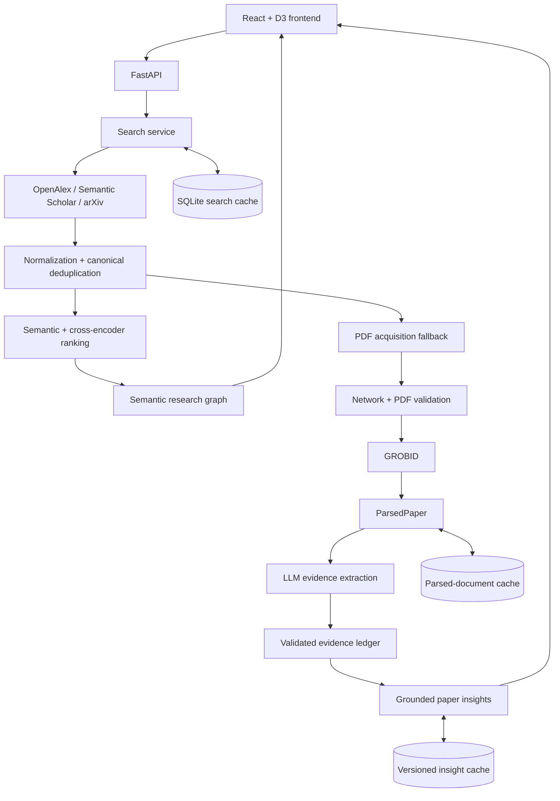

# ResearchWeave

ResearchWeave is an open-source, human-centered visual analytics system for scholarly literature exploration. It brings multi-provider discovery, canonical paper identity, semantic ranking and graph exploration, resilient open-access PDF processing, and evidence-grounded AI paper explanations into one research workflow.

> **Status:** active development / research prototype. The planned first public release is `v0.1.0-alpha`; interfaces and results should not yet be treated as production guarantees.

## What ResearchWeave does

```text
Research topic
  -> multi-provider scholarly search
  -> canonical paper resolution
  -> semantic ranking
  -> interactive research graph
  -> resilient multi-source PDF acquisition
  -> GROBID parsing
  -> evidence-grounded AI insights
```

## Key features

- Searches OpenAlex, Semantic Scholar, and arXiv with bounded query variants and graceful per-provider degradation.
- Normalizes provider records and deterministically deduplicates scholarly works by DOI, arXiv ID, then exact normalized title.
- Combines title-aware semantic ranking with a cross-encoder and configurable rank fusion.
- Builds a sparse, deterministic semantic paper graph in a React/D3 workspace.
- Acquires open-access PDFs through known links, arXiv, and Unpaywall, then falls back to user upload.
- Validates PDFs and parses them locally with GROBID into a provenance-bearing `ParsedPaper`.
- Supports Ollama, Google Gemini, and EVL Gemma behind one paper-understanding provider interface.
- Produces structured paper insights only from a validated evidence ledger with exact chunk/quote provenance.
- Reuses fingerprint- and version-aware parsed-document and insight caches, synchronized from backend state.

## System architecture



See [Architecture](docs/ARCHITECTURE.md) and [frozen graph semantics](backend/GRAPH_SEMANTICS.md) for the implemented boundaries.

## Reliability principles

- One scholarly work maps to one canonical paper identity.
- One provider failure does not discard successful providers.
- PDF acquisition tries all known safe routes; invalid responses fall through to the next route.
- The frontend refreshes parsed-document and insight state from backend authority.
- Parsed and AI-generated analysis caches are keyed by content fingerprints and implementation versions.
- Unsupported LLM output is rejected rather than displayed as grounded evidence.

## Quick start with Docker

Requirements: Docker Desktop (or Docker Engine with Compose) and enough disk space for Python/ML dependencies.

From the repository root:

```bash
docker compose up --build
```

Open the UI at <http://localhost:5173> and the API documentation at <http://localhost:8000/docs>. Basic scholarly search does not require an API key, although public providers may rate-limit unauthenticated traffic. The first ranked search downloads the configured Hugging Face ranking models and can take longer; those files are cached in a Docker volume.

PDF parsing is optional. Start the application with the local GROBID service when needed:

```bash
docker compose --profile pdf up --build
```

The GROBID image is large. It is not required for search or graph exploration.

## Local development

Requirements: Python 3.11, Node.js 20.19+ (or 22.13+), npm 10+, and optionally Docker for GROBID.

Backend:

```bash
cd backend
python -m venv .venv
# Windows: .venv\Scripts\activate
# macOS/Linux: source .venv/bin/activate
python -m pip install -e ".[dev]"
uvicorn app.main:app --reload --port 8000
```

Frontend, in a second terminal:

```bash
cd frontend
npm ci
npm run dev
```

The local-only frontend is at <http://localhost:5173>. `npm run dev:host` explicitly exposes Vite on the network; use it only when intended.

## Configuration

Copy `.env.example` to `.env` only when you need overrides. The example contains safe defaults and empty credential placeholders.

- **No credential required for basic startup:** OpenAlex, arXiv, ranking, graph, and manual PDF upload.
- **Optional scholarly credentials:** `SEMANTIC_SCHOLAR_API_KEY`, `OPENALEX_API_KEY`, and `UNPAYWALL_EMAIL` for DOI-based Unpaywall lookup.
- **Optional local insights:** install Ollama separately, pull the configured `OLLAMA_MODEL` (default `qwen3:1.7b`), and keep `LLM_PROVIDER=ollama`.
- **Optional remote insights:** configure either `GEMINI_API_KEY` or `EVL_GEMMA_API_KEY` only in the backend environment. Paper content is sent to the selected remote provider.
- **Optional PDF parsing:** start the Compose `pdf` profile or provide a compatible `GROBID_URL`.

Never place provider secrets in `VITE_*` variables: those values are embedded in browser assets. See [.env.example](.env.example) for all supported settings.

## Development checks

Backend checks are offline and use mocked providers/models:

```bash
cd backend
pytest
ruff check .
ruff format --check .
```

Frontend checks:

```bash
cd frontend
npm test
npm run lint
npm run typecheck
npm run build
```

Container configuration and bounded application-image build:

```bash
docker compose config --quiet
docker compose build backend frontend
```

CI runs these backend/frontend gates and builds only the backend and frontend images. It does not start GROBID, call scholarly providers, invoke an LLM, download an Ollama model, or require a GPU.

## Project status and roadmap

Implemented:

- **M1:** multi-provider search, canonical retrieval, caching, and ranking.
- **M2:** resilient PDF acquisition/parsing and evidence-grounded structured paper insights.
- **M3:** semantic research graph and coordinated paper-detail exploration.
- **M3.15:** backend-authoritative cached analysis state and reliability hardening.

Planned work includes human-in-the-loop review and steering, relationship explanations, research-landscape synthesis, agentic workflows, and formal evaluation. These are roadmap items, not current features.

## Limitations

- External scholarly providers can be incomplete, rate-limited, or unavailable.
- PDF analysis depends on lawful open-access or user-supplied documents; parsing quality depends on the PDF.
- Ranking models download on first use, and larger profiles can be slow on CPU-only systems.
- LLM output quality and latency vary by provider; remote providers require their own access and privacy review.
- ResearchWeave is a research prototype, not a systematic-review or clinical decision-making substitute.

## Contributing and security

Contributions are welcome; read [CONTRIBUTING.md](CONTRIBUTING.md). Report vulnerabilities privately as described in [SECURITY.md](SECURITY.md), not in a public issue.

## License

ResearchWeave is available under the [MIT License](LICENSE).
